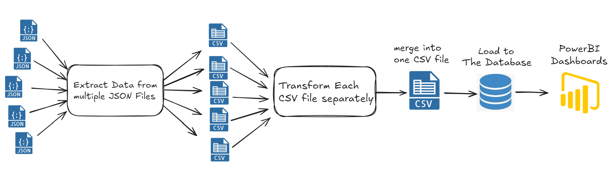
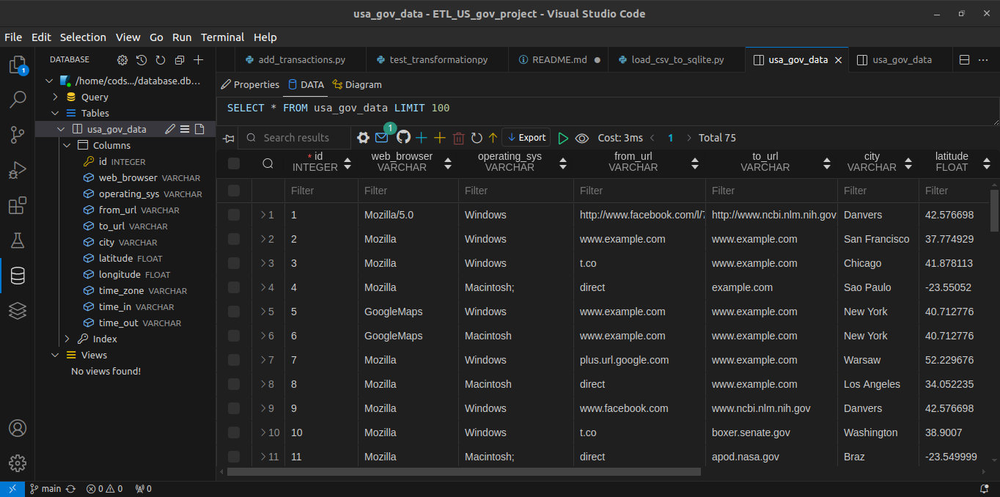
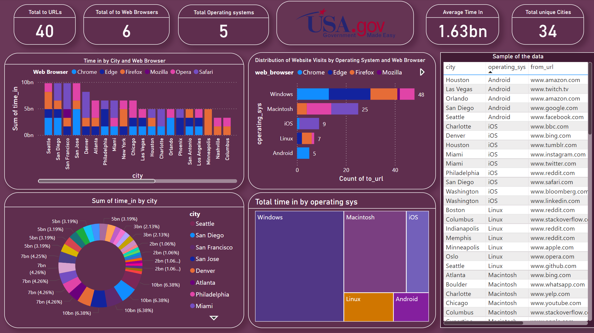

# ETL_US_Gov_Project

This project involves an ETL (Extract, Transform, Load) pipeline that processes web browsing data. The main tasks include merging CSV files, transforming data, and ensuring data quality before analysis.


## Project Overview

### 1. **Data Files**

- **JSON Files:** Input files are located in the `Data` folder.
- **CSV Files:** Output CSV files are saved in the `output_directory` folder.
- **Merged CSV File:** The final merged data is saved as `final_file.csv` in the `merged_output` folder.


### 2. **Scripts**

- **`merge_csvs.py`**

  Merges multiple CSV files from the `output_directory` into a single CSV file. The merged file is saved to `merged_output/final_file.csv`.

- **`data_transformer.py`**

  This module handles data transformation tasks, including converting long URLs to short formats and updating the `operating_sys` field.

- **`load_csv_to_sqlite.py`**

  Loads the transformed CSV data into the SQLite database (`database.db`).

- **`check_transformations.py`**

  Checks if the data transformations are applied correctly. This includes verifying the `operating_sys` field and removing duplicates from the database.

- **`exploration.py`**

  Reads the merged CSV file and performs data exploration tasks using Pandas. This includes generating statistics and visualizations of the data.

- **`main.py`**

  The main entry point of the application that orchestrates the reading, transforming, and writing of data, including loading data into the SQLite database.

- **`utils/helpers.py`**

  Contains utility functions that assist with transformation tasks in the project.

 ### 3. **Database Integration**

- **Database File:** After merging the CSV files, the data is loaded into an SQLite database named `database.db` located in the `final_data_to_sqlite` folder. The database schema and table definitions are included in the `sqlite_shema.py` file.
- **Database:** 


### 4. **Setup and Installation**

1. **Clone the Repository**

   ```bash
   git clone <repository-url>
   cd <repository-directory>
   ```

2. **Install Dependencies**

   Ensure you have the required Python libraries installed. You can install them using pip:

   ```bash
   pip install pandas matplotlib sqlalchemy
   ```

3. **Install SQLite**

   Ensure SQLite is installed on your system. 

### Automated Execution

To run the scheduled script, use the provided `schedule.sh` script:

```bash
./schedule.sh Data usa_gov_click_data4.json usa_gov_click_data5.json usa_gov_click_data7.json
```

To execute both scripts in sequence and measure execution time, use the provided `run_all.sh` script:

```bash
./run_all.sh
```

This script will execute `merge_csvs.py` and `exploration.py`, printing the duration of each script and the total execution time.

## Data Schema

The merged CSV file `final_file.csv` and the SQLite database contain the following columns:

- **`web_browser`**: Browser used
- **`operating_sys`**: Operating system
- **`from_url`**: URL from which the user arrived
- **`to_url`**: URL to which the user navigated
- **`city`**: City of the user
- **`latitude`**: Latitude of the user's location
- **`longitude`**: Longitude of the user's location
- **`time_zone`**: Time zone of the user
- **`time_in`**: Timestamp when the user arrived
- **`time_out`**: Timestamp when the user left

# Power BI

Integrated Power BI to visualize the final dataset.

This includes creating various reports and dashboards to analyze key metrics and insights:
